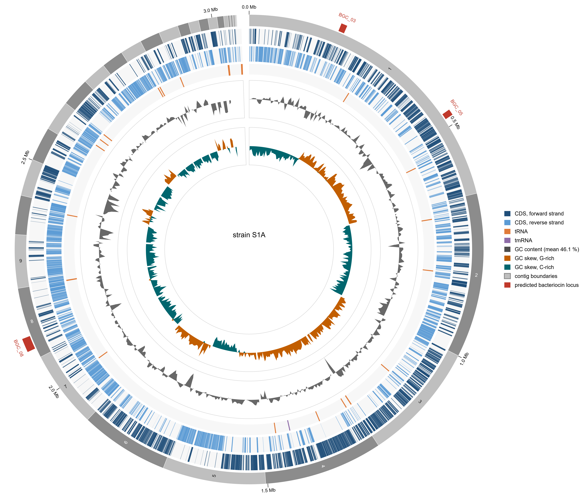
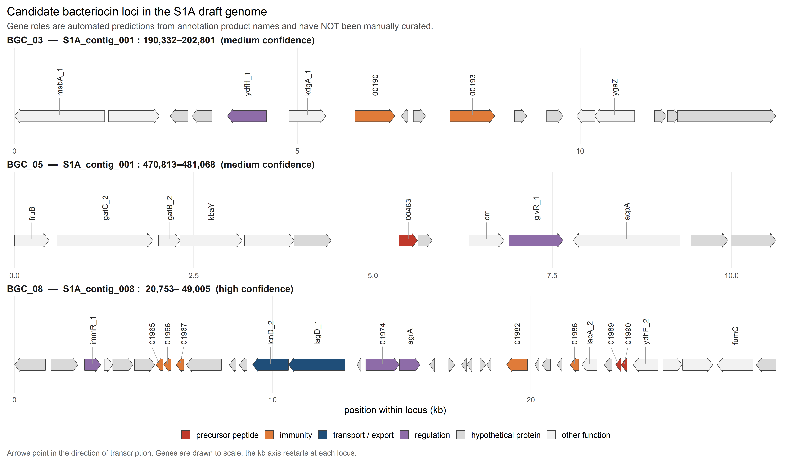
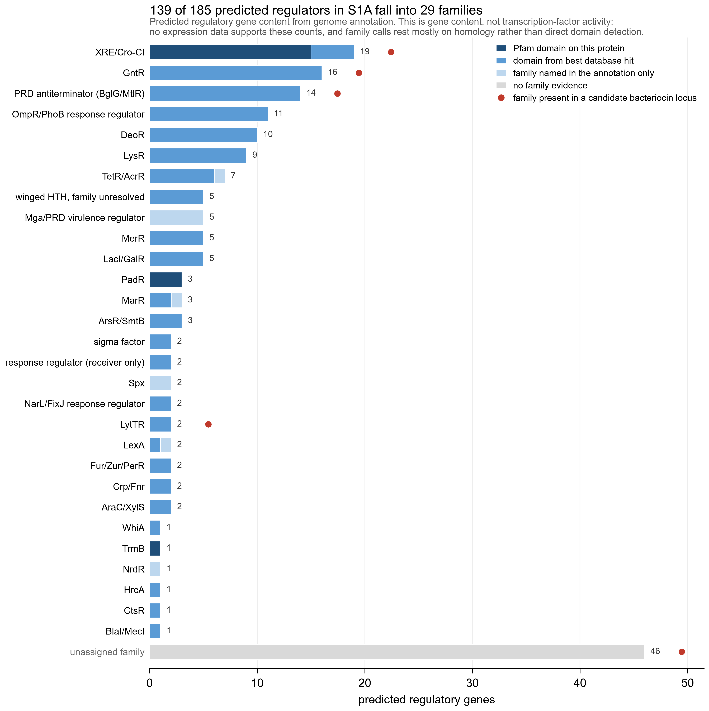

# S1A genome visualisation and regulator analysis

Jan Ephraim R. Vallente

Reproducible figure pipeline for the draft genome of *Lacticaseibacillus* strain
**S1A**, prepared as a figure contribution to a study of probiotic-loaded
antimicrobial hydrogels.

The study proposes that probiotics loaded into a hydrogel enhance its activity
against pathogens. This repository supplies one of the two lines of evidence for
the proposed mechanism: that the probiotic genome carries the genetic machinery
for bacteriocin production and its regulation. The antimicrobial assays supply
the other. Neither line is sufficient alone, and nothing in this repository
demonstrates that any bacteriocin is expressed or active. Genome sequence
establishes capacity, not behaviour, and the figures are captioned accordingly.

---

## Status

The archived figures were generated from a Prokka 1.11 annotation produced in
March 2024 without taxonomic parameters. They are structurally correct and
publication-grade in form, but the gene product names behind them are dated.
The pipeline should be re-run on the Bakta annotation described in
`docs/01_annotation_runbook.md` before submission. Every script takes the
annotation as an input path and resolves the Bakta output automatically once it
exists, so the substitution is an input change and not a code change.

Outstanding before the figures are final:

- [ ] fastANI species call, and the strain identity question recorded below
- [ ] Bakta re-annotation
- [ ] BAGEL4 and antiSMASH locus calls, reconciled by `scripts/parse_bgc.py`
- [ ] Manual curation of gene roles in `results/tables/curation_worksheet.csv`
- [ ] InterProScan run to raise transcription-factor calls to direct domain evidence

### Strain identity

An earlier figure of this genome carried the label *Lacticaseibacillus paracasei*
BCRC-16100. BCRC 16100 is a culture-collection reference strain, whereas `S1A`
is an in-house isolate code; the two cannot denote the same sequenced object
unless a purchased reference strain was sequenced. The annotation itself carries
no taxonomy, its organism field reading `Genus species`. Until fastANI settles
the species assignment and the provenance question is resolved, I have labelled
the figures `strain S1A` and asserted nothing further. A species name the ANI
value does not support would propagate from the Bakta command line into every
product name and into the figure caption.

---

## The genome

| Property | Value |
|---|---|
| Assembly | SPAdes, draft |
| Contigs (≥ 200 bp) | 57 |
| Total length | 3,061,087 bp |
| N50 / L50 | 218,690 bp / 5 |
| Largest contig | 651,111 bp |
| Ambiguous bases | 0 |
| GC content | 46.12 % |
| Median k-mer coverage | 20.3× |
| CDS / tRNA / tmRNA / rRNA | 2,870 / 53 / 1 / 0 |

Completeness and contamination from CheckM2, and ANI against the type strains
from fastANI, are produced by `scripts/run_qc.sh` and belong in this table
before submission.

The assembly is a draft in 57 pieces, and that governs how the figures are
drawn. The circular map is a concatenation of contigs in descending length
order, not a chromosome. Two consequences are built into the code and should
survive editing: contig boundaries remain visible on the outermost track, and GC
skew is computed per contig and reset at every boundary, because cumulative skew
locates a replication origin only in a closed genome.

---

## Figures

### `results/figures/circos_genome.png`



Circular map of the *Lacticaseibacillus* strain S1A draft genome (3.06 Mb, 57
contigs). Tracks from the outside inwards: contig boundaries in alternating
shades, with contigs longer than 100 kb numbered; protein-coding sequences on
the forward and reverse strands; RNA features; GC content as deviation from the
genome mean of 46.12 %; and GC skew, (G−C)/(G+C), in 5 kb non-overlapping
windows. Crimson blocks outside the contig track mark candidate bacteriocin
loci. The axis is a cumulative coordinate across concatenated contigs and does
not correspond to chromosomal position. GC skew is calculated and drawn
separately for each contig and is not cumulative across the assembly; no
replication origin is inferred. The 33 contigs shorter than the 5 kb window,
together 1.19 % of the assembly, carry no window and appear as gaps in the two
inner tracks.

### `results/figures/bacteriocin_clusters.png`



Gene organisation of the candidate bacteriocin loci. Arrows are drawn to scale
and point in the direction of transcription; the kilobase axis restarts at each
locus. Fill colour gives the functional role and is threaded to the circular
map, in which the same crimson marks bacteriocin loci. The roles shown are
automated predictions from annotation product names. Curated calls entered in
`results/tables/curation_worksheet.csv` supersede them, at which point the
figure subtitle changes from a warning to a statement.

### `results/figures/tf_families.png`



Predicted regulatory gene content of the S1A draft genome by family. Of 2,870
CDS, 185 carry regulator-like annotation, of which 139 are assigned to one of 29
families. Bars are stacked by the strength of the evidence behind each call: a
Pfam domain detected on the S1A protein, a domain transferred from the
annotator's best database hit, or the family named in the product string alone.
Regulators with no family evidence appear as a grey residual, separated from the
ranking because a residual is not a family. Crimson dots mark families with at
least one member inside a candidate bacteriocin locus. The counts describe gene
content and not transcription-factor activity; no expression data underlies this
figure.

---

## Result

The genome carries one high-confidence class II bacteriocin locus, `BGC_08`, on
contig 8 between 20,753 and 49,005 bp. Every functional component of a complete
system is present:

| Role | Product | Coordinates |
|---|---|---|
| Precursor peptide × 2 | Bacteriocin class II with double-glycine leader | 43,559–43,775; 43,771–44,005 |
| Immunity × 3 | Enterocin A immunity | 25,753–26,830 |
| Immunity | Putative carnobacteriocin-B2 immunity protein | 41,794–42,130 |
| Immunity and processing | CAAX amino-terminal protease, self-immunity | 39,335–40,148 |
| Transport and processing | LagD, lactococcin-G-processing and transport ATP-binding protein | 30,890–33,083 |
| Accessory secretion | LcnD, lactococcin A secretion protein | 29,500–30,880 |
| Sensor kinase | DcuS-type sensory histidine kinase | 33,879–35,178 |
| Response regulator | AgrA, accessory gene regulator protein A | 35,182–35,989 |

Two features of this locus carry the argument. The two precursor genes are
adjacent and overlap by 4 bp, the architecture of a two-peptide (class IIb)
bacteriocin in which the two peptides are active only in combination. The paired
histidine kinase and AgrA response regulator constitute the quorum-sensing
two-component system that controls operons of this kind; AgrA belongs to the
LytTR family, of which the genome contains two members, one being this gene. The
regulator counted in the transcription-factor figure therefore lies inside the
bacteriocin locus, which is what links the two figures into a single argument.

Two further candidates, `BGC_03` and `BGC_05`, are retained at medium confidence
and shown for comparison. Both are metabolic neighbourhoods that satisfied the
prescan on isolated immunity-like genes, and neither is expected to survive
curation. Five low-confidence candidates are isolated CAAX/Abi protease genes,
recorded in `results/tables/candidate_loci.csv` and excluded from the figures.

---

## Layout

```
scripts/
  _paths.py              repository-relative path resolution; all defaults derive from it
  prepare_assembly.py    filter, sort and rename contigs; stable IDs and mapping table
  run_qc.sh              QUAST, CheckM2, fastANI                        (WSL2)
  run_bakta.sh           Bakta re-annotation                            (WSL2)
  extract_features.py    GenBank to contig, feature, GC and GC-skew tables
  scan_bacteriocins.py   annotation-based locus prescan and curation worksheet
  parse_bgc.py           reconcile antiSMASH, BAGEL4 and prescan locus calls
  classify_tfs.py        regulator family assignment with evidence tiers
  plot_circos.py         circular genome map
  plot_tf.py             transcription-factor family chart
R/
  plot_clusters.R        bacteriocin locus arrow diagram (gggenes)
  requirements.R         R dependencies and renv instructions
docs/
  00_input_inventory.md      the source files, what each is, and which are used
  01_annotation_runbook.md   Bakta, antiSMASH and BAGEL4 procedure
data/
  raw/                   source files, not committed; see data/raw/README.md
  annotation/            Bakta, antiSMASH, BAGEL4, InterProScan output; not committed
  interim/               filtered assembly and the UniProt domain cache
results/
  figures/               PNG at 600 dpi, PDF and SVG
  tables/                every number behind every figure
run_all.sh               regenerate all tables and the two Python figures
RELEASE.md               GitHub and Zenodo release procedure
```

## Reproducing

Every path is resolved relative to the repository root, which each script
derives from its own location. No command below depends on the working
directory, and the repository can be moved between machines and operating
systems without edits.

```bash
# Python half
conda env create -f environment.yml
conda activate s1a-figures
bash run_all.sh
```

```r
# R half
source("R/requirements.R")
source("R/plot_clusters.R")
```

Opening `s1a-genome-figures.Rproj` in RStudio sets the working directory, so the
R step needs no path even when the files are read across a filesystem share.

`classify_tfs.py` queries the UniProt REST API once and caches the response in
`data/interim/uniprot_domains.json`. That cache is committed, so every
subsequent run is offline and reproducible; `--offline` enforces it.

---

## Methods

Text for the manuscript. Bracketed values are to be filled from the runs
described in `docs/01_annotation_runbook.md`.

> Genomic DNA was assembled with SPAdes [version], yielding 57 contigs ≥ 200 bp
> totalling 3,061,087 bp (N50 218,690 bp; 46.12 % GC; no ambiguous bases).
> Assembly quality was assessed with QUAST [version], and genome completeness
> and contamination with CheckM2 [version] ([completeness] % complete,
> [contamination] % contaminated). Species assignment was made by average
> nucleotide identity using fastANI [version] against the type-strain genomes of
> *Lacticaseibacillus paracasei* and *L. casei* ([ANI] % and [ANI] %
> respectively; 95 % species boundary). The assembly was annotated with Bakta
> [version] (database [version]) with `--gram +`. Bacteriocin biosynthetic loci
> were predicted independently with BAGEL4 and antiSMASH [version] in relaxed
> detection mode with KnownClusterBlast, MIBiG comparison and the TFBS finder
> enabled; calls from both tools, together with an annotation-based prescan,
> were reconciled, and cluster boundaries and gene roles were curated manually.
> Predicted transcription factors were identified from annotation product names
> and assigned to families on Pfam domain evidence, taken from InterProScan
> [version] where available and otherwise transferred from the annotator's best
> UniProt hit; each assignment is reported with the evidence tier that produced
> it. The circular genome map was drawn with pyCirclize 1.10.1, with GC content
> and GC skew computed in 5 kb non-overlapping windows and skew calculated per
> contig rather than cumulatively, the assembly not being closed. Bacteriocin
> locus diagrams were drawn with gggenes 0.7.0 under R 4.5.3. Analysis code and
> the tables underlying every figure are archived at [Zenodo DOI].

## Provenance of the archived figures

| | |
|---|---|
| Annotation | Prokka 1.11, run without `--genus`/`--species`, 10 March 2024 |
| Annotation file | `data/raw/annotation_prokka_2024-03/S1A_prokka.gbf` |
| Assembly input | `data/raw/assembly/S1A_spades_contigs.fasta`, 101 SPAdes sequences filtered to 57 at ≥ 200 bp |
| GC window | 5,000 bp, non-overlapping |
| Python | 3.12.14 — biopython 1.88, pandas 3.0.6, numpy 2.5.3, matplotlib 3.11.2, pycirclize 1.10.1 |
| R | 4.5.3 — ggplot2 4.0.3, gggenes 0.7.0, dplyr 1.2.1, readr 2.2.0, ggrepel 0.9.8 |

Source files were renamed on ingestion. `results/tables/rename_manifest.csv`
records the original name, the new path, the SHA-256 digest and the original
modification time of every file, so the renaming is documented and reversible.

## Caveats

1. **Predicted, not demonstrated.** Every locus and every regulator reported
   here is a sequence-based prediction. No expression measurement, peptide
   detection or activity assay supports them.
2. **Homology-transferred domains.** Of 185 regulator family calls, 109 derive
   from a Pfam domain on the annotator's best database hit rather than a domain
   called on the S1A protein. The figure stratifies by this distinction; an
   InterProScan run converts most of those calls to direct evidence.
3. **Draft assembly.** Loci at contig ends may be truncated. antiSMASH reports
   `contig_edge` for this reason, and `parse_bgc.py` carries the flag through.
4. **Small ORFs are under-called.** Prokka 1.11 calls short ORFs poorly, and the
   quorum-sensing induction peptide expected beside the histidine kinase in
   `BGC_08` is not annotated. Bakta's sORF detection should recover it.
5. **No plasmid was identified.** The 13 contigs above twice median coverage are
   all short, 270 to 3,048 bp, with elevated GC, consistent with collapsed rRNA
   operons and IS elements rather than a plasmid. Bacteriocin loci in
   lactobacilli are frequently plasmid-borne, so the absence is worth stating
   rather than assuming.

## Citing

Citation metadata is in `CITATION.cff`. The release procedure and the DOI
workflow are in `RELEASE.md`.

## Licence

Code is released under the MIT licence (`LICENSE`). Figures and tables under
`results/` are released under CC BY 4.0; please cite the DOI.
